# Afterplay

Afterplay keeps track of the games you play, while you play them.

I got tired of finishing a game and having no idea how long it took me, or
scrolling through a backlog of 300 titles with no memory of which ones I'd
actually touched. So I built this. It sits in the tray, notices when a game
starts, and gets out of the way. You launch things however you normally do
(Steam, GOG, a desktop shortcut, an emulator) and it just picks them up.

When you close the game, the session is saved, your save file gets backed up to
your own cloud storage, and a little card asks where you left off so future-you
doesn't have to guess.

Windows, Electron, React, TypeScript. Built for one person with more than one
computer.


---

## Table of contents

- [What it does](#what-it-does)
- [How it works](#how-it-works)
  - [Session tracking](#session-tracking)
  - [Games, playthroughs and sessions](#games-playthroughs-and-sessions)
  - [Logging games you played years ago](#logging-games-you-played-years-ago)
  - [Emulators](#emulators)
  - [Save backups](#save-backups)
  - [Statistics](#statistics)
- [The screens](#the-screens)
- [Getting started](#getting-started)
  - [Install](#install)
  - [API keys](#api-keys)
  - [You don't actually need any of them](#you-dont-actually-need-any-of-them)
- [Where your data lives](#where-your-data-lives)
- [Building from source](#building-from-source)
- [How it's built](#how-its-built)
- [Credits](#credits)

---

## What it does

**Tracks your sessions on its own.** A watcher checks the process list every 5
seconds. Open a game, a session opens. Close it, the session closes with a real
duration.

**Keeps a proper library.** Games come from IGDB, so they arrive with cover art,
banners, developer, publisher, year and genres already filled in. If you don't
like the artwork, SteamGridDB has alternatives.

**Knows you replay things.** A game isn't one row with an hour counter next to
it. Every time you start it over, that's a separate playthrough with its own
platform, format, how you got it, what you spent, your rating and how it ended.
Finish something three times and you get three stories instead of one number.

**Lets you log the past.** Games you played long before this app existed can go
in too. If all you remember is "sometime in 2019", you can say exactly that, and
it still counts everywhere.

**Backs up your saves.** It ships with [ludusavi](https://github.com/mtkennerly/ludusavi),
which knows where thousands of games hide their save files. Backups go to a
Cloudflare R2 bucket you own, automatically, when you stop playing. Restoring is
always something you ask for.

**Shows you patterns you weren't looking for.** Activity heatmap, daily streaks,
hours per month, what time of day you actually play, your hours versus
HowLongToBeat, genres, money spent, cost per hour, how long games sat in the
backlog before you started them, and how many hours of backlog you have left at
the rate you're currently going.

**Syncs between machines.** Optional, using your own Turso database. Everything
works offline and catches up later.

---

## How it works

### Session tracking

Every 5 seconds the watcher does a cheap pass over process names, then a more
expensive check on anything that looked promising: it reads the full command
line and confirms the path really matches. That second step is what stops some
random `game.exe` elsewhere on your disk from being mistaken for yours.

There's a third check for games with anti-cheat that block process inspection.
Afterplay tries to open the executable for writing, which Windows refuses while
the process is alive. Only that specific "file is busy" error counts. A
permissions error means something completely different, and treating it as a
signal would give you false positives forever.

A few things that came out of using it daily:

- **Locking your screen ends the session.** Time staring at a lock screen isn't
  play time. Unlock and it starts a new one if the game's still running.
- **Crashing doesn't cost you the session.** Every cycle writes a heartbeat, so
  if the power goes out the session closes at that heartbeat instead of being
  inflated to whenever you next open the app.
- **Everything gets watched, whatever its status.** Even games marked beaten or
  dropped. You never know when you'll open something again, and catching that is
  the whole point.

When a session ends you get a card with how long you played, your running total,
and one line to write down where you stopped. If the window's tucked away in the
tray you get a Windows notification instead. Click it and you land on the game
with that session highlighted.

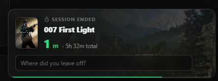

Whatever's running follows you around at the bottom of the sidebar, with a live
counter and a stop button, on every screen.

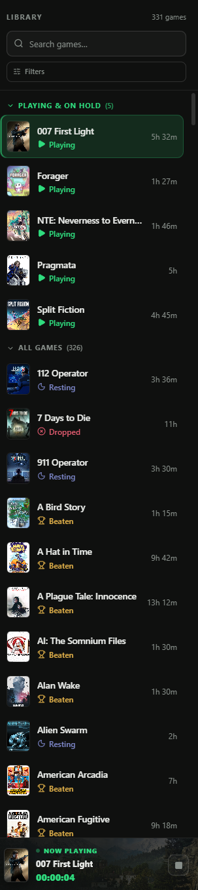

### Games, playthroughs and sessions

Three levels, because most of what you'd want to record isn't a fact about the
game. It's a fact about the time you played it.

| Level           | What it holds                                                                                |
| --------------- | -------------------------------------------------------------------------------------------- |
| **Game**        | Title, artwork, IGDB metadata, HowLongToBeat times, install path, notes                      |
| **Playthrough** | Where you played it, digital or physical, how you got it, hours, rating, spend, how it ended |
| **Session**     | An actual stretch of playing: start, end, duration, and a note if you want one               |

A game's status isn't a field you overwrite. It's worked out from its event log
every time it's read. Marking something as beaten adds an event; the status is
whatever the newest event says. That's why the history stays honest, and why the
app can answer "how long did this sit in my backlog" without anyone having
planned for the question.

Statuses are Unplayed, Playing, Beaten, Dropped and On Hold, plus **Resting**
for endless games. On Hold is a pause in the same playthrough, not an ending, so
going back to Playing just resumes it. Beaten and Dropped are real endings, so
coming back to a game after one of those starts a fresh playthrough.

Games without an ending (Minecraft, Factorio, that sort of thing) get marked as
**endless**. They never show "Complete", never count as backlog, and swap the
status list for Playing, Resting and Dropped.

### Logging games you played years ago

Adding a game gives you three options in one modal: add it as unplayed, add it
with a playthrough you already finished, or scan folders on disk to add a pile
of installed games at once.

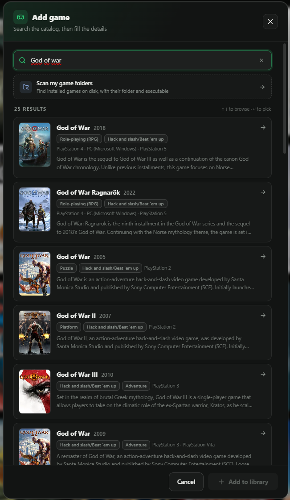

For old playthroughs you can be as vague as your memory. Full date, just the
month, or just the year. The app remembers how precise you were and never
pretends to know more than you told it. Something logged as "2019" shows up as
2019 and counts in 2019.

Point it at the folders where you keep games and it'll match what it finds
against IGDB. After that it watches those folders quietly, so installing
something new makes it appear without you asking for a rescan.

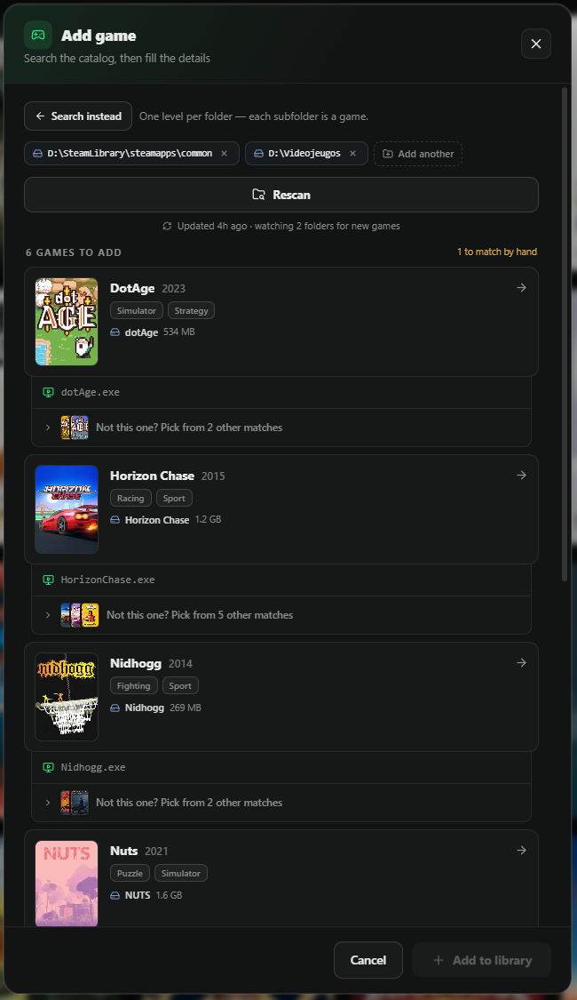

### Emulators

One emulator runs hundreds of different games, so there's no reliable way to
know which one you're playing. Rather than guess and get it wrong, Afterplay
records the session with no owner and drops it in a **Pending** tray for you to
assign.

Register your emulators once, tick "emulated" on the relevant games, and their
sessions get picked up like anything else. Until you assign one it counts in no
statistics at all, which isn't a rule anyone wrote. It falls out of how the data
is shaped.

The sidebar badge tells you how many are waiting, and the Now Playing card shows
a live emulator session in amber with an assign button right there.

### Save backups

[ludusavi](https://github.com/mtkennerly/ludusavi) comes bundled. It carries a
community-maintained list of where games keep their saves, Windows registry keys
included, which turns out to matter more than you'd think.

- **Scan once** in Settings to see which of your installed games it recognises,
  then turn on the ones you care about. Nothing gets uploaded unless you say so,
  game by game.
- **Backups run when you stop playing.** That's the moment the save actually
  changed and a copy is worth having.
- **Games it doesn't recognise** you can set up by hand, either a folder or a
  single file if you're dealing with an emulator memory card.
- **Restoring never happens on its own.** Restore in place (it takes a copy of
  what's there first, so you can undo it), restore to a different folder, or
  export a loose copy somewhere.
- **Restoring on another PC works without setup.** The backup remembers which
  home folder it came from, so `C:/Users/Lara` becomes `C:/Users/Jon` on its own.

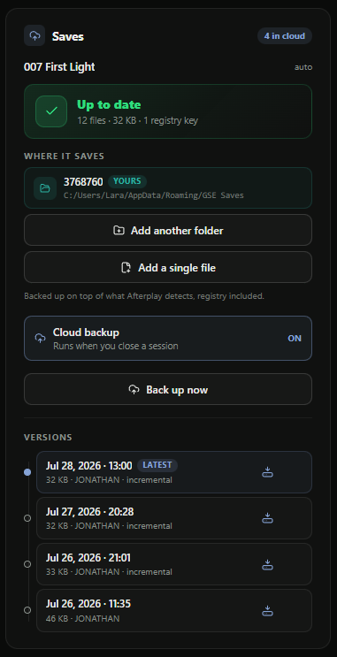

It all goes to a Cloudflare R2 bucket you own. Each machine gets its own folder
inside it, so two PCs can't overwrite each other. The bucket also describes
itself: if you reinstall and lose the local index, Afterplay can read the bucket
and rebuild it, and a fresh install will recognise the folder its previous
installation left behind and reclaim it instead of quietly starting a second one
you'd keep paying for.

The space you're using shows up in Settings without costing a single API call,
because it's a local sum of what got recorded at upload time. Actually reading
the bucket is a separate button you press.

### Statistics

Two panels, one for the whole library and one for a single game. Both filter by
year.

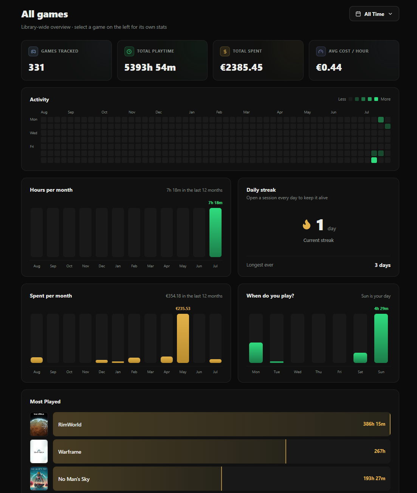

The global one has total playtime and spend, cost per hour, an activity heatmap,
daily streaks, hours and money by month, when in the day you play, session
length distribution, most played, status breakdown, a genre radar, a gallery of
what you finished, your hours against HowLongToBeat, how old the games you play
are, whether your backlog is growing or shrinking, and how many hours of it
you've got left at your current pace.

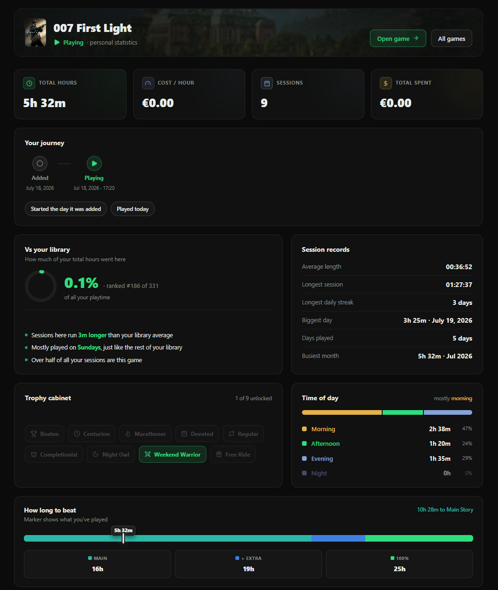

The per-game one narrows down to a single title: its journey from added to
finished, how long it waited before you started, time per playthrough, and how
much of your total playtime it accounts for.

Two rules apply throughout. Manually logged sessions stay out of the
time-of-day charts, because "March 2021" has no meaningful hour attached. And
sessions still running stay out of hour totals until they close.

---

## The screens

**Library.** A grid of covers that flip on hover to show title, year, status,
hours, sessions and progress against HowLongToBeat. The front stays clean
artwork, except for games currently running, which keep their badge visible.
Knowing what's running shouldn't require hovering over it.

**Game detail.** Hero banner, actions, metrics, markdown notes, screenshots,
status and history, sessions, saves, plus a sidebar with HowLongToBeat, the
playthrough panel and technical details.

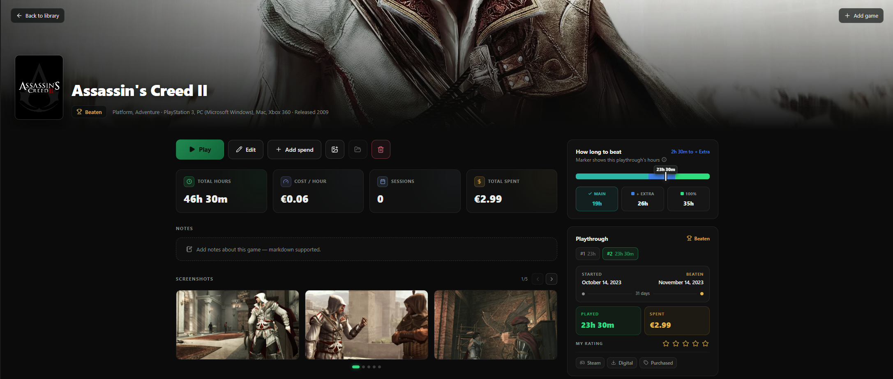

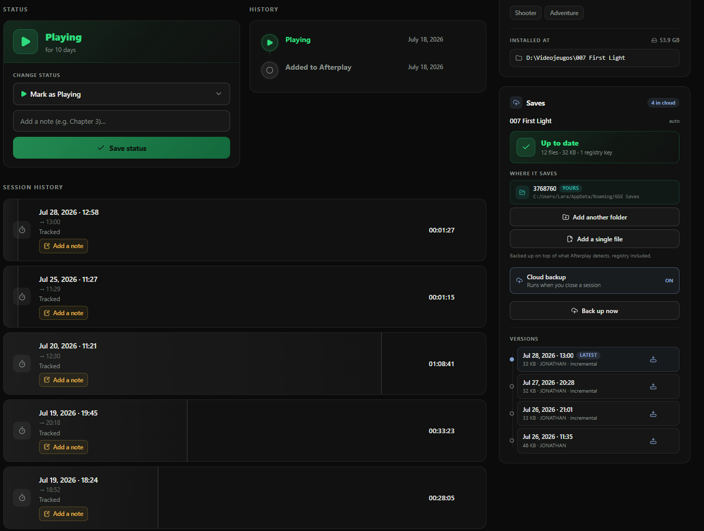

**Sessions.** Everything you've played, grouped by date (Today, Yesterday, This
Week, and down to named months), with the pending emulator tray at the top.

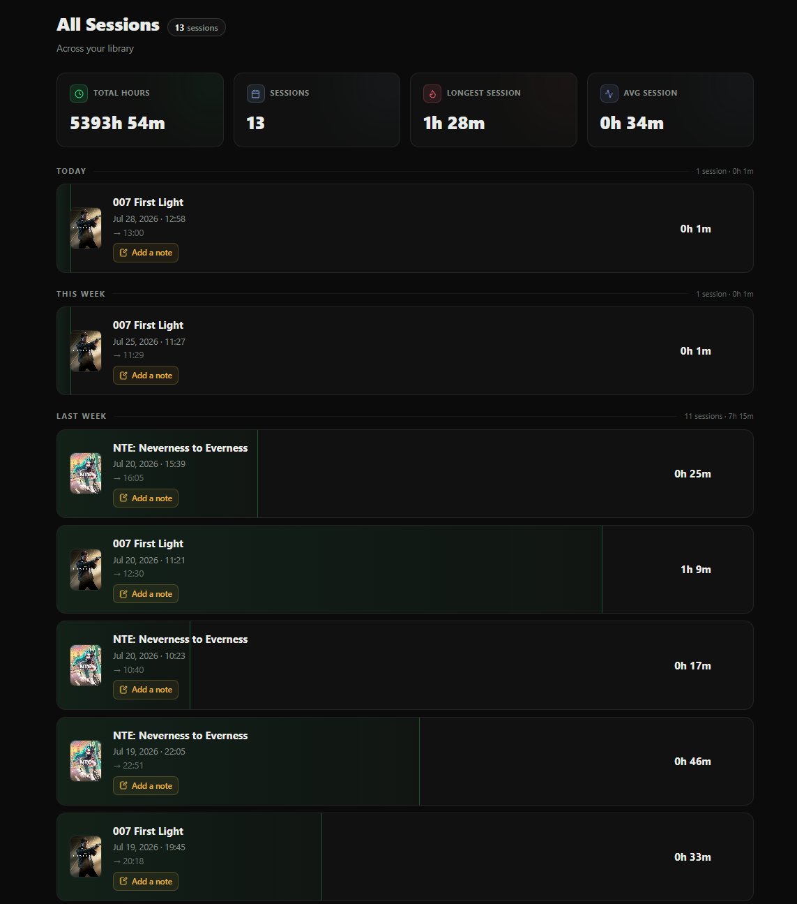

**Plan to play.** Games you mean to get to, kept separate from the library
proper. No playthroughs, no hours, nothing installed. They graduate into the
library when you add them for real.

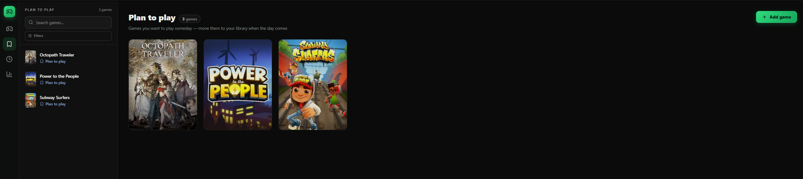

**Settings.** API keys, start with Windows, time format, manual backups, game
folders, save scanning and emulators.

The sidebar on the left is always there, carrying the search box, filters
(status, genre, flags, sorting) and the Now Playing card.

---

## Getting started

### Install

Grab the installer from [Releases](../../releases) and run it. It updates itself
from there.

Running from source is [further down](#building-from-source).

### API keys

Afterplay uses your own keys, which you paste into **Settings → API & Sync**.
They're encrypted on your machine with Windows DPAPI and take effect right away,
no restart.

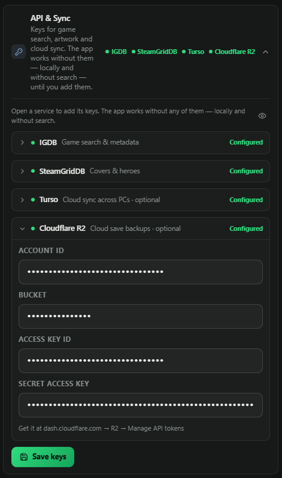

#### IGDB, for game search and metadata _(recommended)_

This is what makes searching for a game work, and what fills in the artwork,
developer, publisher, year and genres. IGDB authenticates through Twitch, which
is why you need a Twitch account.

1. Go to the [Twitch Developer Console](https://dev.twitch.tv/console) and log
   in. You'll need two-factor authentication enabled on the account.
2. **Applications → Register Your Application.**
3. Any name will do. Set the OAuth Redirect URL to `http://localhost` and pick
   whatever category.
4. Copy the **Client ID**, then hit **New Secret** and copy the **Client
   Secret**.
5. Paste both into Settings → API & Sync → IGDB.

#### SteamGridDB, for covers and banners _(recommended)_

For when IGDB's cover isn't the one you wanted.

1. Log in at [steamgriddb.com](https://www.steamgriddb.com).
2. Open [Preferences → API](https://www.steamgriddb.com/profile/preferences/api).
3. Generate a key, paste it into Settings → API & Sync → SteamGridDB.

#### Turso, for syncing across PCs _(optional)_

Only worth setting up if you use more than one computer. Skip it otherwise,
everything works locally.

1. Sign up at [turso.tech](https://turso.tech) and install their CLI.
2. Create a database and get its URL and a token:
   ```bash
   turso db create afterplay
   turso db show afterplay --url
   turso db tokens create afterplay
   ```
3. Paste the URL (starts with `libsql://`) and the token into Settings → API &
   Sync → Turso.
4. Do the same on your other machine, pointing at the same database.

#### Cloudflare R2, for save backups _(optional)_

Where the save backups end up. R2 charges nothing for downloads, which matters
because restoring is the part that downloads.

1. In the [Cloudflare dashboard](https://dash.cloudflare.com), open **R2** and
   make a bucket.
2. **R2 → Manage API tokens → Create API token**, with read and write on that
   bucket.
3. Copy the **Account ID**, **Access Key ID** and **Secret Access Key**.
4. Paste all four values, bucket name included, into Settings → API & Sync →
   Cloudflare R2.

You need all four. Half-configured storage would just produce errors every
session, so the whole feature stays off until every field is there.

Then head to **Settings → Game saves**, run the scan, and switch on whatever you
want backed up.

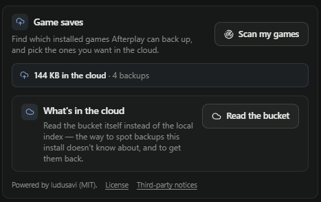

### You don't actually need any of them

With no keys at all, Afterplay still runs, still tracks your sessions, still
records playthroughs, and still draws every chart. What you lose is search:
without IGDB you can't look games up, so you'd be typing everything in yourself.
Sync and save backups are properly optional and off until you turn them on.

---

## Where your data lives

All of it sits in `%APPDATA%\Afterplay`:

| File                 | What it is                                                                                     |
| -------------------- | ---------------------------------------------------------------------------------------------- |
| `Afterplay.db`       | The database. Games, playthroughs, sessions, events, spending                                  |
| `credentials.json`   | Your API keys, encrypted with DPAPI                                                            |
| `config.json`        | Preferences: time format, window size, scanned folders                                         |
| `machine-saves.json` | Things true of _this_ PC only: its id, its home folder, per-game restore targets. Never synced |
| `save-backups/`      | Local working copy of the save backups                                                         |
| `scan-cache.json`    | Cache for the folder scanner                                                                   |
| `backups/`           | Daily rotating copies of the database                                                          |

The database backs itself up once a day, and you can drop an extra copy anywhere
you like from **Settings → Backups**.

Anything specific to one machine is deliberately kept out of the database. The
database travels between PCs, and a file path from another computer is worse
than no path at all, since it points confidently at something that isn't there.

---

## Building from source

Node 20 or newer, and Windows if you want the full build.

```bash
git clone <your-repo-url>
cd Afterplay
npm install
npm run dev
```

| Command                  | What it does                              |
| ------------------------ | ----------------------------------------- |
| `npm run dev`            | Development with hot reload               |
| `npm run typecheck`      | Type-check main and renderer              |
| `npm run lint`           | ESLint, cached                            |
| `npm run build`          | Type-check and build                      |
| `npm run build:win`      | Full Windows installer                    |
| `npm run build:unpack`   | Unpacked build, for checking packaging    |
| `npm run ludusavi:fetch` | Download the pinned ludusavi binary       |
| `npm run db:push:remote` | Push pending migrations straight to Turso |

The ludusavi binary isn't in the repo. It's 33 MB and Git would hang on to every
version of it forever. `ludusavi.lock.json` pins the exact release and its
SHA-256, and the build downloads and verifies it. Don't edit that file by hand:

```bash
npm run ludusavi:fetch -- --bump 0.32.0
npm run ludusavi:fetch -- --smoke
```

The smoke run checks the new CLI still speaks the same language, which is worth
doing because ludusavi is pre-1.0 and breaks something about once a year.

Schema migrations go straight to Turso on startup rather than trusting the sync
layer to replicate them, because it doesn't handle table rebuilds reliably.

---

## How it's built

A few rules the code actually sticks to.

**Offline-first.** No connection, no problem. Sync reconnects in place when the
network comes back, no restart involved.

**Work it out, don't store it.** A game's status is computed from its event log
when read. One source of truth, nothing to drift.

**Watch, don't take over.** The watcher finds your game however you launched it.
You never have to start anything from inside the app.

**Nothing happens behind your back.** No polling cloud storage, no automatic
restores, no checks on startup. If something costs an API call or touches your
files, it's a button.

**Make dangerous things harder than safe ones.** Deleting a session asks you to
confirm. Deleting a game makes you type its title out. Restoring a save over
your current one copies the current one first, so you can walk it back.

**Show nothing rather than show an empty box.** Sections with no data don't
render. The one exception is notes, because a section that never appears is a
feature nobody discovers.

**Comments explain why, not what.** They're there for the decisions and the real
bugs behind them, never to narrate the line underneath. It's the most consistent
habit in the codebase.

---

## Credits

- [ludusavi](https://github.com/mtkennerly/ludusavi) by mtkennerly, the save
  backup engine, bundled under MIT. Its license and third-party notices ship
  with the app and you can open them from Settings.
- [IGDB](https://www.igdb.com) for game metadata.
- [SteamGridDB](https://www.steamgriddb.com) for community artwork.
- [HowLongToBeat](https://howlongtobeat.com) for completion times.

This is a personal project and isn't affiliated with any of them.
